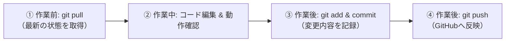

# クエストドリル（Gamification Drill）

向井ゼミ（子どもICTコース / RiTan Lab.）平田唯 卒業研究プロジェクト  
**「学習意欲の湧くゲーム性のある勉強アプリの開発研究」** プロトタイプ

---

## 🌟 プロジェクト概要
子どもや学習者が主体的に・楽しくドリル演習に取り組めるよう、ゲーミフィケーション要素（EXP、レベルアップ、バッジ、コイン、音響演出等）を取り入れた4択問題学習Webアプリケーションです。

- **技術スタック**: HTML5, CSS3, JavaScript (Vanilla JS / フレームワーク・バックエンドなし)
- **データ管理**: ブラウザの `localStorage` ＋ CSVインポート／エクスポート ＋ JSONバックアップ
- **想定ターゲット端末**: Chromebook, Androidタブレット・スマートフォン, PC

---

## 🚀 学生向け：開発のはじめかた（VS Code編）

平田さん（学生）が自分のパソコンで開発を進めるための手順です。

### 1. リポジトリを自分のパソコンにクローン（ダウンロード）する
1. **VS Code** を開きます。
2. キーボードで `Ctrl + Shift + P`（Macは `Cmd + Shift + P`）を押し、コマンドパレットを開きます。
3. `Git: Clone` と入力して選択します。
4. リポジトリURLを入力します:
   ```text
   https://github.com/MUKAI-Daiki/gamification-drill.git
   ```
5. 保存先フォルダ（例: `ドキュメント` や `デスクトップ` など）を選んでクローンします。
6. 右下に「クローンしたリポジトリを開きますか？」と出たら **「開く」** をクリックします。

### 2. アプリをブラウザで動かしてみる
1. VS Codeの拡張機能（左メニューの四角いアイコン）を開き、**「Live Server」**（Ritwick Dey氏作）をインストールします。
2. 左のエクスプローラーから `index.html` を開きます。
3. VS Code画面右下の **「Go Live」** ボタンをクリックするか、`index.html` を右クリックして **「Open with Live Server」** を選択します。
4. ブラウザが自動で立ち上がり、アプリが起動します！

---

## 🔄 先生と学生の共同作業・同期ルール

お互いの変更が上書きされたり衝突（コンフリクト）しないよう、以下の**基本サイクル**で進めましょう。

### 基本サイクル（1日の作業の流れ）



1. **作業を始める前【最重要】**:
   - 必ず `git pull`（VS Code左下の同期ボタン 🔄 を押す、またはソース管理画面で「プル」）を行い、最新のコードを取り込んでから作業を始めます。
2. **作業中**:
   - 「今日はクイズの演出を変える」「アバター画面のUIを作る」など、作業内容を決めて進めます。
3. **作業が終わったら**:
   - ソース管理タブ（Gitアイコン）を開き、変更したファイルを確認します。
   - コミットメッセージ（例: `クイズの正解アニメーションを調整`, `新しいバッジを追加` など）を入力して **「コミット」** します。
   - **「変更の同期（Push）」** を押して、GitHubに最新コードを送信します。

---

## 📁 ディレクトリ構成

```text
gamification-drill/
├── index.html            # メイン画面（冒険広場・学習モード・履歴・管理画面）
├── manifest.json         # Chromebook/Android向けPWA設定
├── css/
│   └── style.css         # アプリのデザイン・スタイルシート
├── js/
│   ├── app.js            # 全体制御・タブ切り替え・画面初期化
│   ├── storage.js        # LocalStorage（問題・プロファイル・履歴管理）
│   ├── quiz.js           # 4択クイズ進行・効果音・リザルト計算
│   └── admin.js          # CSVインポート・エクスポート・問題管理
└── data/
    └── sample-questions.csv # テスト用サンプル問題CSV
```
